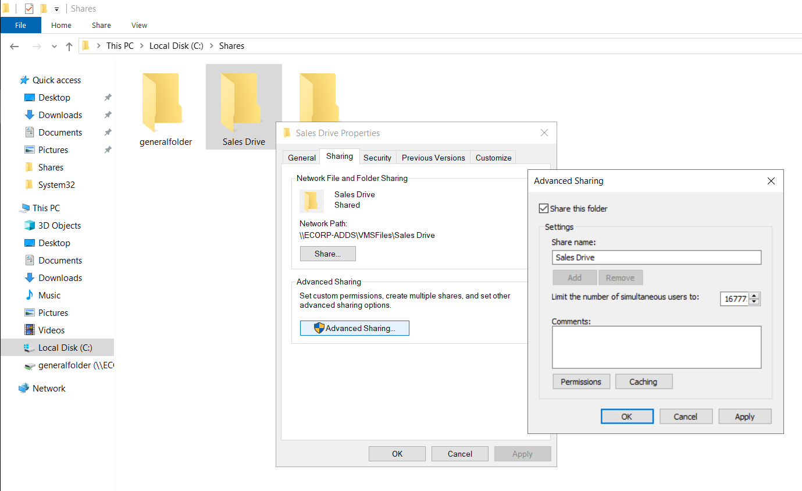
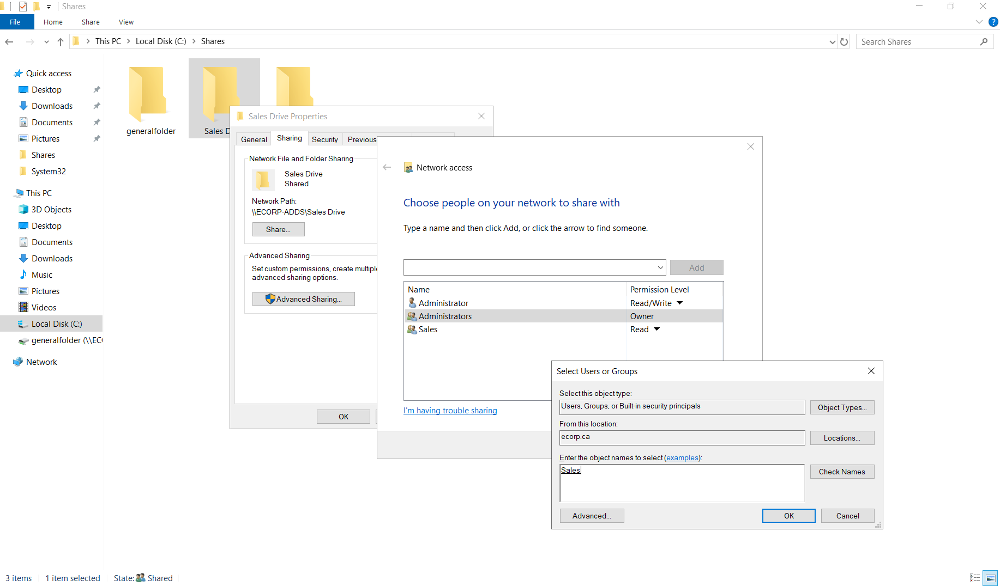
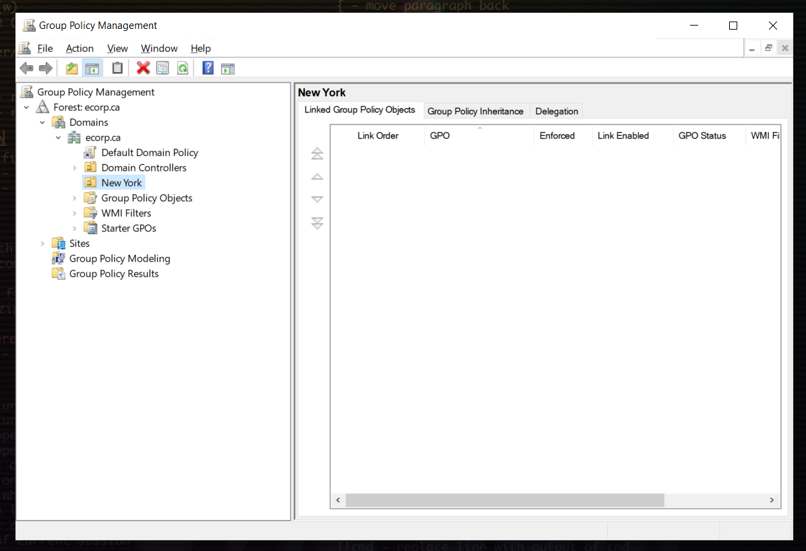
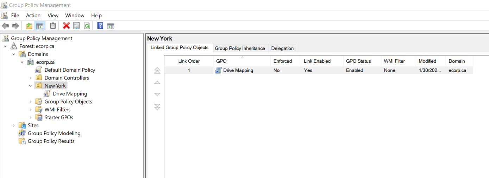
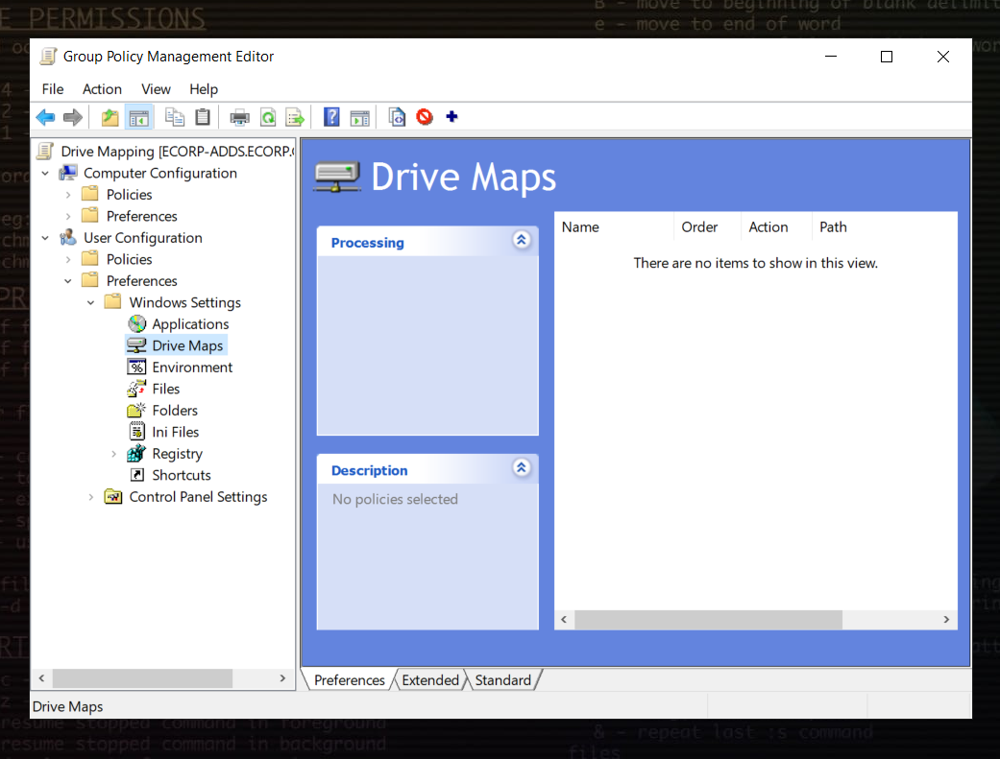
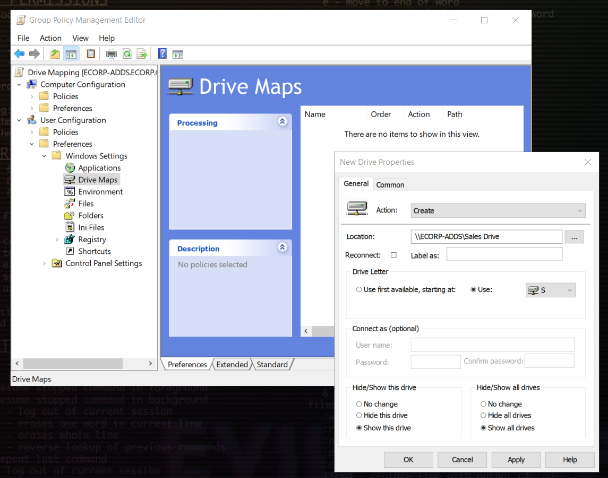
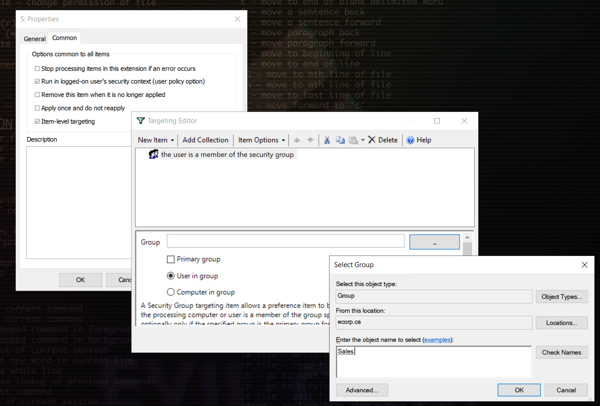
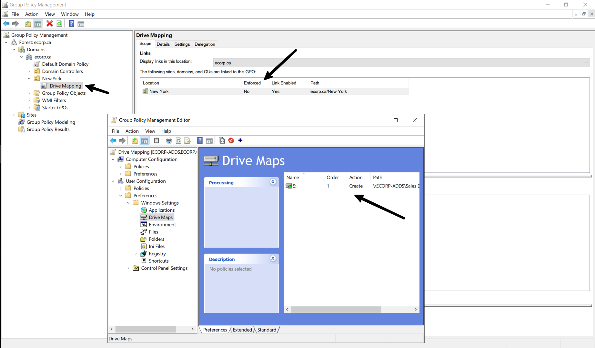
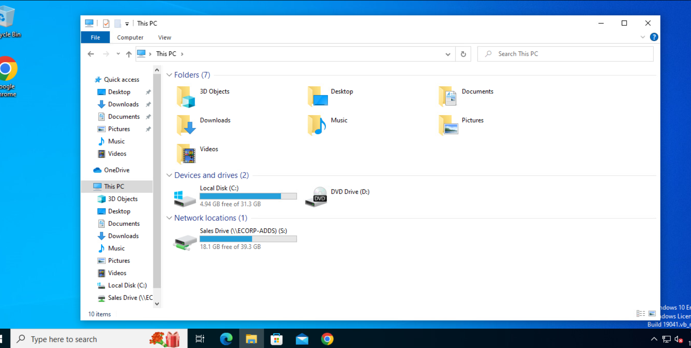

><h3>Scenario #1 - You are a network tech, assigned to create a network drive with the name 'Sales' accessible only to the Sales team, which should be mapped automatically on the respective user accounts.</h3>

1. Logon to the DC, configure the drive/folder to be shared. Go to the drive/folder's properties, click `Sharing`. If you don't see the `Share` option highlighted, go to `Advanced Sharing` and turn on **Share this folder**.
    
    
 

2. Now, click on `Share`. Click on the dropdown appearing right above the current permissions list in the **Network Access** window. Input the name of your security group/users which need access to the network drive. For this scenario, the entity in question is the security group - *'Sales'*.   
**Copy the network path of this drive/folder.** 
Then, click 'OK' → 'Share' and finally 'Done' to finalize the share. Close the drive/folder properties window.

    
 

3. Open `Group Policy Management` from the Windows search bar.

    
 

4. Right-click the OU containing your selected security group and select `Create a GPO in this domain and, Link it here...`. Provide a name for the group policy. For demonstration purposes, a separate GPO for drive sharing/mapping has been created.  
Alternatively, a new GPO can be created in the `Group Policy Objects` option and then linked to the desired OU. 

    
 

5. Select the newly created GPO, right-click and go to `Edit`. Go `Preferences` under `User Configuration`. Expand `Windows Settings`. Click on `Drive Maps`.

    
 

6. Right-click anywhere on the window and select `New` → `Mapped Drive`. 
    - Set the following values for **GENERAL**:

        - Action = Create (Since we're creating a new drive in the network)
        - Location = Network address copied in Step 2.
        - Label As = Empty
        - Drive Letter = `Use` and select any alphabet. 
        - Hide/Show this drive = Show this drive
        - Hide/Show all drives = Show all drives

            

    - Perform the following for **COMMON**:

        - Select the options `Run in logged-on user's security context (user policy option)` and `Item-level targeting`.
        - Open `Targeting` → `New Item` → `Security Group`. 
        - Click on the three dots besides the group input option, Select your desired group and click `OK`.
        - Finally, click `Apply` and `OK` for all windows and close the properties window. 
            
            
 

7. The group policy wizard should look like this. Launch PowerShell or Command-Prompt and type the `gpupdate /force`.

    
 

8. Login to a workstation device using credentials of a user in the Sales security group to ensure the creation and mapping of the network drive.

    
 
        